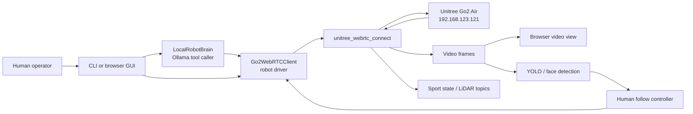
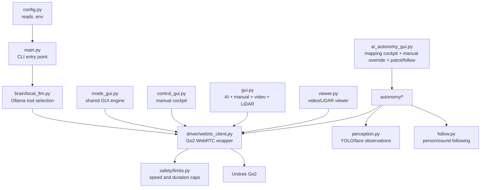
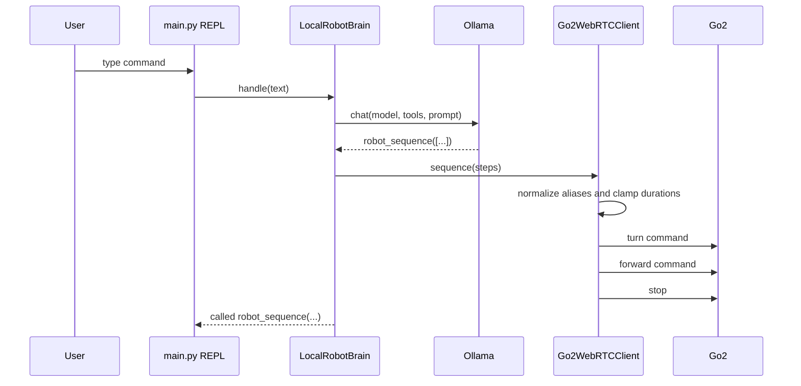
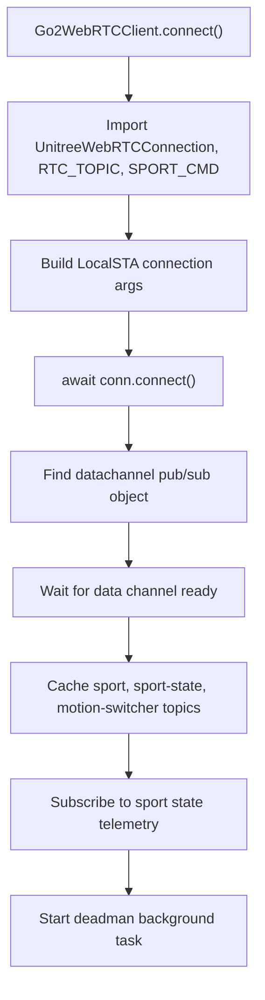
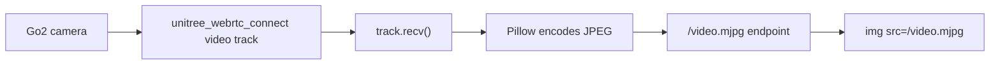
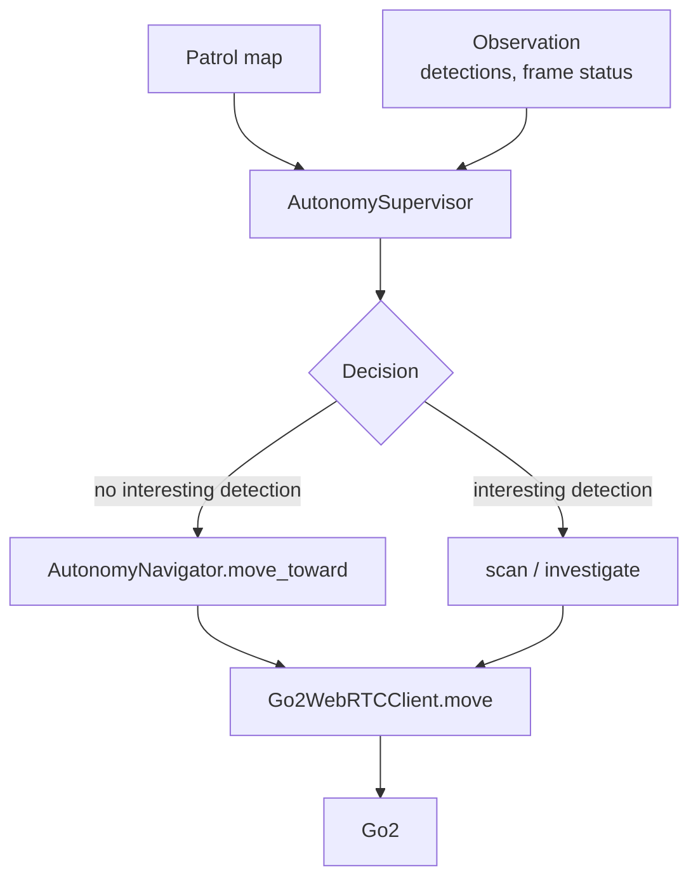
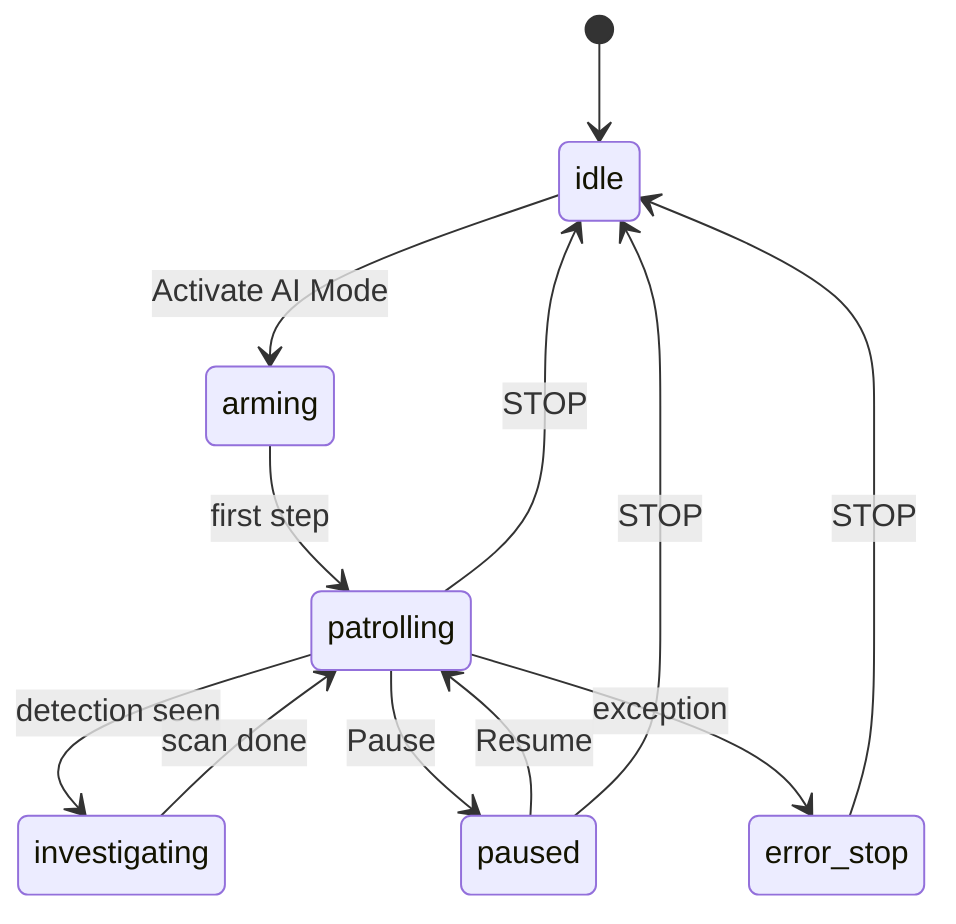
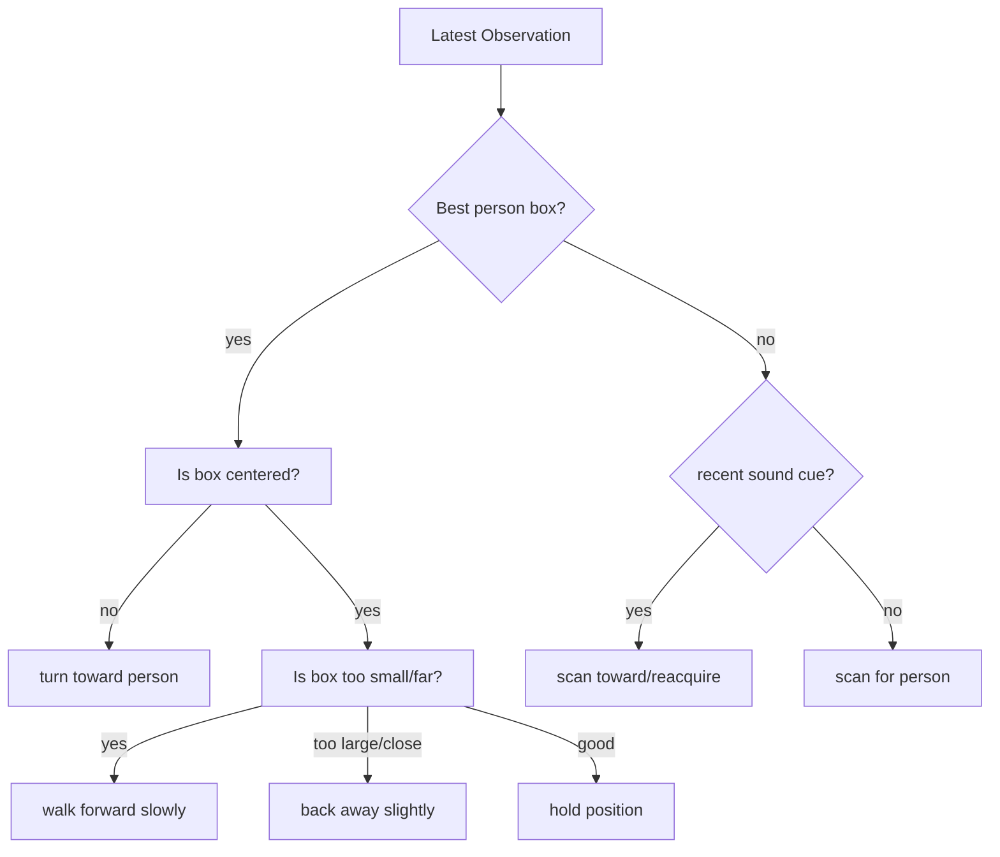

# go2_local_brain

`go2_local_brain` is a local Python control brain for the **Unitree Go2 Air**. It connects to the robot over WebRTC, asks a local Ollama model to choose robot tools, and exposes several command-line and browser GUIs for manual driving, AI commands, live video, LiDAR experiments, autonomy maps, human detection, and follow behavior.

This README is written as both:

- an operator manual for running the robot, and
- a maintainer manual for someone who does not know Python yet but wants to understand and upgrade the code safely.

If you only need to run it, start with the install guides and command cheat sheet. If you want to change it, read the architecture and file walkthrough sections.

## Table Of Contents

- [Known Hardware Setup](#known-hardware-setup)
- [What This Project Does](#what-this-project-does)
- [Quick Command Cheat Sheet](#quick-command-cheat-sheet)
- [Installation Guide 1: WSL Instance](#installation-guide-1-wsl-instance)
- [Installation Guide 2: Jetson Orin Nano](#installation-guide-2-jetson-orin-nano)
- [Recommended Jetson Runtime Layout](#recommended-jetson-runtime-layout)
- [Python Concepts For Beginners](#python-concepts-for-beginners)
- [Project Architecture](#project-architecture)
- [How A Text Prompt Becomes Robot Motion](#how-a-text-prompt-becomes-robot-motion)
- [How WebRTC Robot Control Works](#how-webrtc-robot-control-works)
- [Browser GUIs](#browser-guis)
- [AI-Only Autonomy](#ai-only-autonomy)
- [Human Detection, Face Detection, And Follow Mode](#human-detection-face-detection-and-follow-mode)
- [Maps And Patrol Routes](#maps-and-patrol-routes)
- [LiDAR And Telemetry](#lidar-and-telemetry)
- [File-By-File Walkthrough](#file-by-file-walkthrough)
- [How To Upgrade The Project](#how-to-upgrade-the-project)
- [Testing](#testing)
- [Troubleshooting](#troubleshooting)
- [Safety Notes](#safety-notes)
- [Glossary](#glossary)

## Known Hardware Setup


| Part | Value |
| --- | --- |
| Robot | Unitree Go2 Air |
| Firmware | `1.1.7` |
| Robot state | Jailbroken, SSH open on port 22 |
| Robot STA/control IP | `192.168.123.121` |
| Secondary observed Go2 IP | `192.168.123.161` |
| Jetson Orin target IP | `192.168.123.18` |
| Jetson OS target | JetPack `6.2.1` |
| WSL-host IP on robot subnet | `192.168.123.x` |
| Local model | `qwen3:1.7b` through Ollama |
| AES key | blank unless a future firmware path requires one |

The most important environment setting is:

```env
GO2_IP=192.168.123.121
```

`GO2_IP` points at the dog. It does not point at the Jetson.

## Recommended Jetson Runtime Layout

The preferred production layout is:

```text
Go2 Air <-> Jetson Orin Nano <-> browser on WSL instance
```

The Jetson should run:

- the WebRTC robot connection,
- live video frame decoding,
- LiDAR parsing and map state,
- YOLO/person detection,
- follow and patrol loops,
- Ollama with `qwen3:1.7b`,
- the port `8775` browser cockpit.

The WSL instance should only open:

```text
http://192.168.123.18:8775
```

The Jetson does not need a separate video upload service. The app receives WebRTC video from the robot, converts frames to JPEG, and serves the browser stream from `/video.mjpg`. See [docs/jetson_orin_deploy.md](docs/jetson_orin_deploy.md) for the full deployment guide, systemd service, and network checks.

## What This Project Does

At a high level:

1. Python loads settings from `.env`.
2. Python connects to the Go2 using `unitree_webrtc_connect`.
3. The user types commands or clicks buttons.
4. If using AI mode, Ollama chooses one tool call.
5. The driver turns that tool call into short robot commands.
6. Browser GUIs can also show video, LiDAR attempts, maps, detections, and follow controls.



This project intentionally keeps most robot movement short and interruptible. The dog is not given a raw, endless stream of AI velocity. Instead, the AI or GUI asks for small actions such as "walk forward for 0.55 seconds," "turn right," or "follow this person box for one step."

## Quick Command Cheat Sheet

Clone and install:

```bash
cd ~/robotics
git clone https://github.com/creeskis/go2_local_brain.git
cd go2_local_brain
python3 -m venv .venv
source .venv/bin/activate
pip install --upgrade pip
pip install -e .
```

Run tests:

```bash
source .venv/bin/activate
python scripts/smoke_test_imports.py
python -m unittest discover -s tests
```

Run the simple AI command-line brain:

```bash
source .venv/bin/activate
python -m go2_local_brain.main
```

Run manual video cockpit:

```bash
python -m go2_local_brain.control_gui --host 0.0.0.0 --port 8770
```

Run the primary mapping cockpit with WASD/manual override, map builder, patrol, follow, and video:

```bash
python -m go2_local_brain.ai_autonomy_gui --host 0.0.0.0 --port 8775 --maps-dir maps
```

Run AI-only autonomy with human detection and face boxes:

```bash
pip install -e ".[vision]"
python -m go2_local_brain.ai_autonomy_gui --host 0.0.0.0 --port 8775 --maps-dir maps --detector yolo --face-detection
```

Run AI-only autonomy with local sound cue support:

```bash
pip install -e ".[vision,audio]"
python -m go2_local_brain.ai_autonomy_gui --host 0.0.0.0 --port 8775 --maps-dir maps --detector yolo --face-detection --follow-source visual-or-sound
```

Upgrade after pulling new code:

```bash
cd ~/robotics/go2_local_brain
git pull
source .venv/bin/activate
pip install -e .
python scripts/smoke_test_imports.py
python -m unittest discover -s tests
```

## Installation Guide 1: WSL Instance

Use this when running from a WSL instance on the Windows laptop.

### 1. Configure WSL Networking

Recommended Windows file:

```text
%USERPROFILE%\.wslconfig
```

Recommended contents:

```ini
[wsl2]
networkingMode=mirrored
memory=24GB
processors=8
```

Restart WSL from PowerShell:

```powershell
wsl --shutdown
```

Open the WSL instance again.

### 2. Confirm Robot And Jetson Reachability

```bash
ping -c 3 192.168.123.121
ping -c 3 192.168.123.18
```

If the robot ping fails, fix network reachability before debugging Python. The app cannot connect if WSL cannot reach the robot IP.

### 3. Install System Packages

```bash
sudo apt update
sudo apt install -y python3 python3-venv python3-pip git curl portaudio19-dev
```

`portaudio19-dev` is only needed for local microphone support, but it is harmless to install early.

### 4. Clone And Create The Python Environment

```bash
cd ~
mkdir -p robotics
cd robotics
git clone https://github.com/creeskis/go2_local_brain.git
cd go2_local_brain
python3 -m venv .venv
source .venv/bin/activate
pip install --upgrade pip
pip install -e .
```

What these commands mean:

- `python3 -m venv .venv` creates a private Python install folder for this repo.
- `source .venv/bin/activate` tells the shell to use that private Python.
- `pip install -e .` installs this repo in editable mode, so code edits take effect without reinstalling the package every time.

### 5. Configure `.env`

```bash
cp .env.example .env
nano .env
```

Recommended base config:

```env
GO2_IP=192.168.123.121
GO2_AES_128_KEY=
OLLAMA_MODEL=qwen3:1.7b
# OLLAMA_HOST=
# FORCE_MOTION_MODE=
```

Exploration config:

```env
ENABLE_EXPLORATION=1
EXPLORATION_MODE=telemetry
EXPLORATION_MIN_OBSTACLE_M=0.35
EXPLORATION_MAX_DURATION_S=15
```

Exploration modes:

| Mode | Meaning |
| --- | --- |
| `telemetry` | Require fresh nonzero `range_obstacle` before exploring. |
| `relaxed` | Use `range_obstacle` if it is available, otherwise use small arcs. |
| `blind` | Ignore obstacle telemetry. Use only in a clear test area. |

### 6. Install Ollama

Skip this if Ollama is running somewhere else and `OLLAMA_HOST` points at it.

```bash
curl -fsSL https://ollama.com/install.sh | sh
ollama pull qwen3:1.7b
ollama list
curl http://localhost:11434/api/tags
```

### 7. Test And Run

```bash
source .venv/bin/activate
python scripts/smoke_test_imports.py
python -m unittest discover -s tests
python -m go2_local_brain.main
```

## Installation Guide 2: Jetson Orin Nano

Use this when moving the project onto the Jetson.

### 1. Confirm Basics

```bash
python3 --version
uname -a
cat /etc/os-release
ping -c 3 192.168.123.121
```

### 2. Install System Packages

```bash
sudo apt update
sudo apt install -y python3 python3-venv python3-pip git curl portaudio19-dev
```

### 3. Clone And Install

```bash
cd ~
mkdir -p robotics
cd robotics
git clone https://github.com/creeskis/go2_local_brain.git
cd go2_local_brain
python3 -m venv .venv
source .venv/bin/activate
pip install --upgrade pip
pip install -e .
```

For human detection:

```bash
pip install -e ".[vision]"
```

For local microphone sound cues:

```bash
pip install -e ".[audio]"
```

For both:

```bash
pip install -e ".[vision,audio]"
```

### 4. Configure `.env`

```bash
cp .env.jetson.example .env
nano .env
```

Recommended Jetson config:

```env
GO2_IP=192.168.123.121
GO2_AES_128_KEY=
OLLAMA_MODEL=qwen3:1.7b
# OLLAMA_HOST=
# FORCE_MOTION_MODE=
ENABLE_EXPLORATION=1
EXPLORATION_MODE=relaxed
EXPLORATION_MIN_OBSTACLE_M=0.35
EXPLORATION_MAX_DURATION_S=15
```

Leave `OLLAMA_HOST` unset if Ollama runs locally on the Jetson.

### 5. Install Ollama

```bash
curl -fsSL https://ollama.com/install.sh | sh
ollama pull qwen3:1.7b
ollama list
```

### 6. Test And Run

```bash
source .venv/bin/activate
python scripts/smoke_test_imports.py
python -m unittest discover -s tests
./scripts/run_jetson_cockpit.sh
```

Then open this from the WSL instance:

```text
http://192.168.123.18:8775
```

For a boot service, run `scripts/install_jetson_service.sh` on the Jetson. It installs `deploy/systemd/go2-local-brain.service` with the current username and repo path. The complete Jetson operating guide is in [docs/jetson_orin_deploy.md](docs/jetson_orin_deploy.md).

## Python Concepts For Beginners

This project is Python. Here are the concepts you need to read the code without panic.

### Modules

A file ending in `.py` is a Python module. For example:

```text
src/go2_local_brain/main.py
```

is the module:

```text
go2_local_brain.main
```

That is why you run it with:

```bash
python -m go2_local_brain.main
```

### Packages

A folder with Python files is a package. This repo uses the standard `src/` layout:

```text
src/go2_local_brain/
```

That folder is the package. Subfolders like `brain/`, `driver/`, and `autonomy/` group related code.

### Functions

A function is a named block of code. Example:

```python
def load_config() -> AppConfig:
    ...
```

This means "define a function called `load_config` that returns an `AppConfig`."

### Classes

A class is a blueprint for an object that owns data and behavior. Example:

```python
class Go2WebRTCClient:
    ...
```

The driver class owns the robot connection, movement commands, sport commands, telemetry cache, and shutdown logic.

### Dataclasses

Dataclasses are simple containers for values. Example:

```python
@dataclass(frozen=True)
class Go2Config:
    ip: str
    aes_128_key: Optional[str] = None
```

That creates a small structured object with fields like `ip` and `aes_128_key`.

### Async / Await

Robot control waits on network operations, video frames, and browser requests. Python uses `async` and `await` for this.

Simple mental model:

- `async def` defines a function that can pause without freezing the whole program.
- `await` means "wait here, but let other tasks run."
- `asyncio.create_task(...)` starts background work, such as the deadman loop or perception loop.

Example:

```python
await client.connect()
await client.move(0.25, 0.0, 0.0, 0.5)
```

The code waits for the robot connection, then waits for a short movement command to complete.

### Editable Install

This command:

```bash
pip install -e .
```

means "install this project, but keep it linked to this folder." When you edit files in `src/`, Python will use the edited version.

## Project Architecture

The project is intentionally split into small areas.



The most important rule for maintainers:

```text
Browser/AI code asks for behavior.
driver/webrtc_client.py is the only place that should know how to publish robot movement and sport commands.
```

That keeps movement safety and robot protocol details in one place.

## How A Text Prompt Becomes Robot Motion

This is the path when you run:

```bash
python -m go2_local_brain.main
```

and type:

```text
turn right 90 degrees, then walk forward
```



### The System Prompt

The big `_SYSTEM_PROMPT` in `src/go2_local_brain/brain/local_llm.py` tells Ollama:

- choose exactly one tool call per user message,
- use `robot_sequence` for multi-step commands,
- map hind-leg requests to `robot_backstand`,
- map handstand requests to `robot_handstand`,
- use `robot_explore_room` for exploration,
- use `robot_telemetry_report` for telemetry questions.

### Tool Schemas

`_TOOL_SCHEMAS` tells Ollama which tools exist and what arguments each tool accepts.

Example:

```text
robot_turn_180(direction="left" or "right")
```

Ollama does not directly run Python. It returns a tool call. Python then validates that call and runs the matching method.

### Tool Handler

`LocalRobotBrain.handle()` does the heavy lifting:

1. Builds messages for Ollama.
2. Calls `ollama.chat(...)` in a worker thread.
3. Extracts tool calls from the response.
4. Rejects unknown tools.
5. Runs the matching Python method.
6. Stops the robot if Ollama fails, returns no tool, sends bad arguments, or picks an unknown tool.

That last behavior is deliberate. If the AI is confused, the safe default is stop.

## How WebRTC Robot Control Works

The robot driver lives here:

```text
src/go2_local_brain/driver/webrtc_client.py
```

It wraps `unitree_webrtc_connect` so the rest of the app can call friendly methods:

```python
await client.stand_up()
await client.move(0.3, 0.0, 0.0, 0.5)
await client.advanced_action("backstand")
```

### Connection Flow



### Movement

The main movement method is:

```python
await client.move(vx, vy, vyaw, duration_s)
```

Argument meanings:

| Argument | Meaning |
| --- | --- |
| `vx` | forward/back velocity |
| `vy` | left/right strafe velocity |
| `vyaw` | turn velocity |
| `duration_s` | how long to keep publishing movement |

The driver clamps movement using values from:

```text
src/go2_local_brain/safety/limits.py
```

Movement is sent repeatedly at about 20 Hz until the short duration ends. Then the driver sends stop.

### Deadman Loop

The deadman loop runs in the background. If movement commands get stale, it tries to publish zero velocity. This is a safety net for missed key-up events, stalled loops, and interrupted commands.

It is not magic. Always keep physical space clear and be ready to stop the robot.

### Sport Commands

Unitree's SDK exposes named sport commands such as:

```text
StandUp
BalanceStand
Move
StopMove
Hello
Dance1
HandStand
BackStand
FreeJump
```

The exact list depends on the installed `unitree_webrtc_connect` package and firmware. The driver checks both `SPORT_CMD` and `SPORT_CMD_MCF` when trying advanced actions.

### Advanced Actions

Advanced action aliases live in `_ADVANCED_ACTIONS`.

Example:

```python
"backstand": [("BackStand", {"data": True})]
```

This means:

- if the user asks for backstand,
- try the exact firmware command `BackStand`,
- send parameter `{"data": True}` if required by that command.

## Browser GUIs

The repo has several browser entry points. They all create one Python web server with `aiohttp`, connect to the robot, and serve a local web page.

| Use case | Module | Port |
| --- | --- | --- |
| Unified AI/manual/video/LiDAR cockpit | `go2_local_brain.gui` | `8765` |
| Manual-only video cockpit with buttons | `go2_local_brain.control_gui` | `8770` |
| AI prompt + video, hidden WASD | `go2_local_brain.ai_cli_video_gui` | `8771` |
| AI prompt + video + LiDAR | `go2_local_brain.ai_lidar_gui` | `8772` |
| WASD + video | `go2_local_brain.wasd_video_gui` | `8773` |
| AI + WASD + video + LiDAR | `go2_local_brain.ai_wasd_lidar_gui` | `8774` |
| Primary mapping cockpit: WASD/manual override + map creation + patrol/follow | `go2_local_brain.ai_autonomy_gui` | `8775` |

Run examples:

```bash
python -m go2_local_brain.gui --host 0.0.0.0 --port 8765
python -m go2_local_brain.control_gui --host 0.0.0.0 --port 8770
python -m go2_local_brain.ai_autonomy_gui --host 0.0.0.0 --port 8775 --maps-dir maps
```

Open from the host browser:

```text
http://localhost:8775
```

If the GUI is running inside WSL and localhost does not resolve from Windows, use the WSL IP or mirrored networking configuration.

### Video Path



The browser does not use a fancy video player. It uses a normal image tag pointed at an MJPEG stream.

## Mapping Cockpit And AI Autonomy

The main browser workflow lives here:

```text
src/go2_local_brain/ai_autonomy_gui.py
src/go2_local_brain/autonomy/
```

Run:

```bash
python -m go2_local_brain.ai_autonomy_gui --host 0.0.0.0 --port 8775 --maps-dir maps
```

With YOLO:

```bash
pip install -e ".[vision]"
python -m go2_local_brain.ai_autonomy_gui --host 0.0.0.0 --port 8775 --maps-dir maps --detector yolo --yolo-model yolov8n.pt
```

This is the GUI to use when building maps. It combines:

- live video,
- fixed-origin map plane,
- live local pose trail,
- click-to-add waypoints,
- map save/load,
- WASD/manual override,
- sport-command override buttons,
- patrol activation,
- detection/follow controls.

Manual movement pauses patrol/follow and takes over immediately. The map plane uses a fixed local origin from the first valid sport-state pose in the current session, so waypoint capture, patrol navigation, and the visible trail all use the same coordinate frame.

### Autonomy Design

The LLM does not directly drive continuous velocity in AI-only mode. The deterministic Python supervisor owns the movement loop.



State machine:



### Key Classes

| File | Class | Purpose |
| --- | --- | --- |
| `autonomy/map.py` | `PatrolMap`, `Waypoint` | Save/load map JSON and validate routes. |
| `autonomy/local_map.py` | `LocalMapState`, `Pose2D` | Convert sport-state pose into an origin-locked local map and trail. |
| `autonomy/navigator.py` | `AutonomyNavigator` | Convert a waypoint into one short move or turn. |
| `autonomy/supervisor.py` | `AutonomySupervisor` | Own autonomy state, route index, pause/resume/stop, and event log. |
| `autonomy/perception.py` | `Observation`, `Detection`, providers | Report camera and object detections. |
| `autonomy/follow.py` | `HumanFollowController` | Follow a person box or scan after sound cues. |

## Human Detection, Face Detection, And Follow Mode

Human detection is currently done through YOLO. YOLO labels people as `person`.

Run:

```bash
pip install -e ".[vision]"
python -m go2_local_brain.ai_autonomy_gui --host 0.0.0.0 --port 8775 --maps-dir maps --detector yolo --face-detection
```

The browser draws:

- yellow boxes around humans,
- blue boxes around faces if optional OpenCV face detection finds them.

### Detection Data Shape

The Python object:

```python
Detection("person", 0.82, x=320, y=240, width=160, height=240)
```

means:

- label: `person`
- confidence: `0.82`
- center x: `320`
- center y: `240`
- box width: `160`
- box height: `240`

`Observation.to_dict()` converts pixel boxes into normalized boxes from `0.0` to `1.0` so the browser can draw them over whatever size the video appears on screen.

### Follow Mode

Follow mode lives in:

```text
src/go2_local_brain/autonomy/follow.py
```

It does not use the LLM. It is a deterministic controller:



Why it works this way:

- A person left of center means the robot should turn left.
- A person right of center means the robot should turn right.
- A small person box usually means the person is far away, so move forward.
- A huge person box usually means the person is too close, so back up.

### Sound Cues

Optional audio support:

```bash
pip install -e ".[audio]"
```

Run with visual or sound:

```bash
python -m go2_local_brain.ai_autonomy_gui --host 0.0.0.0 --port 8775 --maps-dir maps --detector yolo --face-detection --follow-source visual-or-sound
```

Important limitation:

```text
A normal mono laptop microphone can tell that sound happened.
It cannot reliably tell where the sound came from.
```

So mono sound cues trigger scanning. True sound-direction following needs a stereo mic or mic array. The code is ready for that through:

```python
SoundCue(timestamp=..., level=..., direction=...)
```

where `direction` is intended to be a signed turn direction in radians.

## Maps And Patrol Routes

There is intentionally no configured `home.json` in the repo. Maps are operator data.

The browser map builder saves JSON files under:

```text
maps/
```

The repo keeps `maps/.gitkeep` so the folder exists, but your real maps should be treated like local data.

### Map JSON Shape

```json
{
  "schema_version": 1,
  "name": "home-starter",
  "waypoints": {
    "home": {"x": 0.0, "y": 0.0, "yaw": 0.0, "note": "Start"},
    "room_center": {"x": 1.2, "y": 0.0, "yaw": 0.0}
  },
  "patrol_route": ["home", "room_center"],
  "no_go_zones": ["stairs"]
}
```

### Draft Maps

Incomplete maps can be saved as drafts. A map is patrol-ready only when:

1. it has at least one waypoint,
2. it has a non-empty `patrol_route`,
3. every route name exists in `waypoints`.

Saving a patrol-ready map loads it automatically. Saving a draft does not replace the active patrol map.

### Coordinates

Map coordinates are local meters from the session origin. The first valid sport-state `position` and IMU yaw become `(0, 0, 0)`, then later positions are rotated into that start frame. This is still odometry-based, not full SLAM: long sessions can drift, and saved maps should be checked before autonomous patrol.

### Startup Localization

For a saved map to stay useful across restarts, do not let the current boot silently become a new origin. Use the mapping cockpit's **Startup localization waypoint** field:

1. Load a saved map.
2. Put the robot at a known waypoint, such as `home`.
3. Type that waypoint name into **Startup localization waypoint**.
4. Click **Lock Current Robot To Waypoint/Pose**.

After that, the current raw sport-state odometry is anchored to the saved map pose. The trail, waypoint capture, occupancy cells, and patrol navigation all use that same map frame.

### LiDAR Local Avoidance And Learned Runs

The primary cockpit now subscribes to the Unitree LiDAR topics and keeps two LiDAR products:

- a robot-relative obstacle bubble for front/left/right/rear clearance,
- a coarse map-frame occupancy layer drawn as red cells on the map.

Patrol still follows the saved waypoint route, but if fresh LiDAR sees an obstacle closer than about `0.70m` in front, the navigator backs up slightly and turns toward the clearer side for that step.

To improve a route by repeated runs:

1. Load and localize the saved map.
2. Click **Record Run**.
3. Patrol or manually drive one loop.
4. Click **Stop Run**.
5. Repeat a few times.
6. Click **Average Runs** to draw the averaged orange path.
7. Click **Save Runs** to write `maps/runs/learned-runs.json` and `maps/runs/lidar-occupancy.json`.

The averaged path is a route suggestion, not a motor controller. Deterministic code still owns collision checks and movement.

## LiDAR And Telemetry

The project has LiDAR viewer experiments, but current tested telemetry showed:

```text
range_obstacle=[0,0,0,0]
```

That means the sport-state obstacle field was not usable in that run. It does not prove the robot has no LiDAR or that all obstacle APIs are unavailable.

Known telemetry/control areas from upstream SDK naming:

| Area | Meaning |
| --- | --- |
| `LF_SPORT_MOD_STATE` | Sport state, pose, IMU, gait, velocity, `range_obstacle`. |
| lowstate | Lower-level robot state, still needs deeper diagnostics here. |
| LiDAR stream | Point cloud or LiDAR data, currently experimental in this repo. |
| obstacle APIs | Separate obstacle behavior may exist outside sport state. |

Use the AI command:

```text
what telemetry do you see
```

The driver will summarize sport-state age, keys, and whether `range_obstacle` is usable.

## File-By-File Walkthrough

This section explains what every important file does.

### Root Files

| File | What it does |
| --- | --- |
| `README.md` | This manual. |
| `pyproject.toml` | Package metadata and dependencies. |
| `.env.example` | Template for environment settings. |
| `.gitignore` | Files Git should ignore. |
| `bootstrap.sh` | Helper install script, if used. |

### `src/go2_local_brain/config.py`

Reads `.env` and environment variables.

Important function:

```python
load_config()
```

Important settings:

| Setting | Meaning |
| --- | --- |
| `GO2_IP` | Robot IP. |
| `GO2_AES_128_KEY` | Optional WebRTC AES key. Usually blank here. |
| `OLLAMA_MODEL` | Local Ollama model, usually `qwen3:1.7b`. |
| `FORCE_MOTION_MODE` | Optional firmware motion mode override. |
| `ENABLE_EXPLORATION` | Must be true before exploration tools run. |
| `EXPLORATION_MODE` | `telemetry`, `relaxed`, or `blind`. |

### `src/go2_local_brain/main.py`

The simplest entry point.

It:

1. configures logging,
2. loads config,
3. creates `Go2WebRTCClient`,
4. connects to the robot,
5. creates `LocalRobotBrain`,
6. starts a text REPL,
7. closes the robot connection on exit.

### `src/go2_local_brain/brain/local_llm.py`

This is the natural-language brain.

Important parts:

| Part | Meaning |
| --- | --- |
| `_SYSTEM_PROMPT` | Instructions given to Ollama. |
| `_TOOL_SCHEMAS` | Tool definitions Ollama can choose from. |
| `LocalRobotBrain._tools` | Python function table matching tool names. |
| `LocalRobotBrain.handle()` | One prompt in, one tool call out. |
| `LocalRobotBrain.repl()` | Command-line loop. |

If you want to add a new AI command:

1. Add a schema to `_TOOL_SCHEMAS`.
2. Add a Python method like `_tool_new_thing`.
3. Add it to `self._tools`.
4. Implement the robot behavior in the driver if needed.
5. Add tests in `tests/test_brain.py`.

### `src/go2_local_brain/driver/webrtc_client.py`

This is the robot driver and most important safety boundary.

It owns:

- WebRTC connection,
- data-channel pub/sub,
- sport command publishing,
- movement clamping,
- deadman zero-velocity loop,
- advanced actions,
- sequences,
- exploration,
- sport-state telemetry cache.

If a change sends bytes to the robot, it probably belongs here or should call this file.

### `src/go2_local_brain/safety/limits.py`

Defines movement limits:

- max forward/back velocity,
- max strafe velocity,
- max yaw velocity,
- default movement duration,
- max movement duration,
- deadman timeout.

If the dog is too aggressive, reduce values here first.

### `src/go2_local_brain/viewer.py`

Standalone live video and LiDAR viewer.

It connects to the robot, starts video if enabled, subscribes to LiDAR-ish topics if enabled, and serves a browser page.

### `src/go2_local_brain/control_gui.py`

Manual-only browser cockpit.

Use this when you want:

- video,
- WASD/QE keyboard movement,
- buttons for sport commands,
- no AI,
- no LiDAR.

This is often the best test mode after a fresh install.

### `src/go2_local_brain/mode_gui.py`

Shared engine for the feature-specific browser modes.

The wrapper modules below mostly call into this shared implementation:

- `ai_cli_video_gui.py`
- `ai_lidar_gui.py`
- `wasd_video_gui.py`
- `ai_wasd_lidar_gui.py`

### `src/go2_local_brain/gui.py`

Unified GUI for manual controls, AI prompt box, video, and LiDAR in one process.

Use it after isolated video/control modes work.

### `src/go2_local_brain/ai_autonomy_gui.py`

Primary browser cockpit for:

- WASD/manual override,
- exact sport-command override buttons,
- map building,
- map saving/loading,
- autonomy activation,
- live video,
- perception health,
- detection overlay,
- follow mode.

It uses `aiohttp` routes like:

| Route | Meaning |
| --- | --- |
| `/` | Browser HTML page. |
| `/video.mjpg` | Live MJPEG video stream. |
| `/status.json` | Current robot/autonomy/perception/follow state. |
| `/detections.json` | Latest observation/detection data. |
| `/api/maps` | List saved maps. |
| `/api/maps/save` | Save map from browser editor. |
| `/api/maps/load` | Load saved map. |
| `/api/perception/check` | Check detector readiness. |
| `/api/manual/move` | Manual WASD/button movement override. |
| `/api/manual/stop` | Manual stop override. |
| `/api/manual/sport` | Exact sport-command override. |
| `/api/autonomy/{action}` | Activate/pause/resume/step/stop patrol. |
| `/api/follow/{action}` | Start/step/stop follow mode. |

### `src/go2_local_brain/autonomy/map.py`

Owns map data.

Important pieces:

| Name | Meaning |
| --- | --- |
| `Waypoint` | One named point. |
| `PatrolMap` | Map name, waypoints, route, no-go zones. |
| `load_patrol_map` | Read JSON file into `PatrolMap`. |
| `save_patrol_map` | Save `PatrolMap` as JSON. |
| `list_patrol_maps` | Show metadata for maps in a folder. |
| `validate_for_patrol` | Reject maps that cannot run. |

### `src/go2_local_brain/autonomy/navigator.py`

Turns one waypoint into one short robot action.

Current simple behavior:

- if waypoint is close, scan,
- if waypoint is off-angle, turn,
- otherwise step forward.

This is not full localization yet.

### `src/go2_local_brain/autonomy/supervisor.py`

Owns the AI-only patrol loop.

It keeps:

- current state,
- active task,
- current route index,
- last observation,
- last action,
- event log.

It can:

- activate,
- pause,
- resume,
- stop,
- run one step.

### `src/go2_local_brain/autonomy/perception.py`

Owns camera observations and detections.

Important classes:

| Name | Meaning |
| --- | --- |
| `Detection` | One object box, such as `person`. |
| `Observation` | Camera availability plus detections. |
| `PerceptionHealth` | Whether the detector is ready. |
| `CameraOnlyPerceptionProvider` | Reports camera frames but no detections. |
| `YoloPerceptionProvider` | Runs YOLO over latest JPEG frame. |

Important helpers:

| Helper | Meaning |
| --- | --- |
| `best_human_detection` | Pick highest-confidence person/human box. |
| `detection_to_dict` | Convert detection to browser JSON. |
| `_normalized_box` | Convert pixel box to 0 to 1 screen coordinates. |

YOLO prediction runs in a worker thread so slow inference does not freeze the async web server.

### `src/go2_local_brain/autonomy/follow.py`

Owns follow behavior.

Important classes:

| Name | Meaning |
| --- | --- |
| `SoundCue` | Sound level and optional direction. |
| `FollowCommand` | Planned `vx`, `vyaw`, duration, reason. |
| `HumanFollowController` | Turns person boxes into movement. |
| `LocalSoundLevelProvider` | Optional mono microphone cue provider. |

This file is intentionally testable without a robot.

### `src/go2_local_brain/viz/rerun_logger.py`

Rerun visualization helper. This is for logging/visualization experiments and is not required for basic robot control.

### `scripts/smoke_test_imports.py`

Quick import smoke test. Run it after install:

```bash
python scripts/smoke_test_imports.py
```

If this fails, the package or dependencies are broken before robot control even starts.

### `scripts/eval_model_tools.py`

Helper for evaluating model tool-call behavior. Use this when comparing Ollama models or prompt changes.

### Tests

| Test file | Covers |
| --- | --- |
| `tests/test_brain.py` | Ollama tool extraction and brain behavior. |
| `tests/test_driver.py` | Movement clamps, sequence aliases, driver safety behavior. |
| `tests/test_viewer.py` | Viewer parsing/rendering helpers. |
| `tests/test_autonomy.py` | Map loading, supervisor, perception, follow controller. |

## How To Upgrade The Project

This section is for a human maintainer taking over future work.

### Golden Rule

Make one behavior change at a time and test it before stacking another change on top.

Good upgrade cycle:

```bash
git status
git pull
source .venv/bin/activate
python scripts/smoke_test_imports.py
python -m unittest discover -s tests
```

Then edit code, then run:

```bash
python -m compileall -q src
python -m unittest discover -s tests
```

### Add A New Robot Action

Example: add a new `robot_wave` tool.

1. Find the firmware command name in `unitree_webrtc_connect` constants.
2. Add an alias to `_ADVANCED_ACTIONS` in `driver/webrtc_client.py`.
3. Add a tool schema in `brain/local_llm.py`.
4. Add `_tool_wave()` in `LocalRobotBrain`.
5. Add `"robot_wave": self._tool_wave` to `self._tools`.
6. Add prompt examples to `_SYSTEM_PROMPT`.
7. Add tests in `tests/test_brain.py` or `tests/test_driver.py`.
8. Run tests.
9. Test on robot in a clear area.

### Add A New GUI Button

1. Decide which GUI should get the button.
2. Add a browser button in the HTML string.
3. Add a JavaScript function that calls a backend route.
4. Add an `aiohttp` route in Python.
5. Have the route call `Go2WebRTCClient`.
6. Return JSON with `ok`, `result`, and status if useful.
7. Test in browser.

### Add A New Perception Backend

Keep the `PerceptionProvider` interface:

```python
class PerceptionProvider:
    async def observe(self) -> Observation:
        ...

    async def health(self) -> PerceptionHealth:
        ...
```

A new backend should:

- not block the event loop,
- return `Observation`,
- include `frame_width` and `frame_height` when it returns boxes,
- return useful `PerceptionHealth` detail when it is not ready,
- be optional if it needs heavy dependencies.

### Add Stereo Sound Direction

The current hook is ready:

```python
SoundCue(timestamp: float, level: float, direction: float | None = None)
```

A stereo or mic-array provider should:

1. listen to two or more channels,
2. estimate direction,
3. return `SoundCue(direction=...)`,
4. not block the GUI loop,
5. be optional and off by default,
6. include synthetic-signal tests.

### Improve Pose-Based Patrol

The current patrol path uses sport-state odometry through `LocalMapState`. The right next step is pose-topic probing for a better localization source.

Desired flow:

1. Subscribe to possible pose topics.
2. Confirm which topics publish on Go2 Air firmware `1.1.7`.
3. Compare the current sport-state pose with any better `(x, y, yaw)` topic.
4. Feed the best source into `LocalMapState` without changing the browser map schema.
5. Keep all movements short and cancellable.

### Add No-Go Zones

`PatrolMap.no_go_zones` exists but is not fully enforced yet.

Good implementation path:

1. Decide no-go zone shape, such as named circles or polygons.
2. Extend the map schema with versioning.
3. Validate no-go zones in `map.py`.
4. Have `AutonomyNavigator` reject movements through a no-go zone.
5. Show zones in the browser map UI.
6. Add tests.

## Testing

Run everything:

```bash
source .venv/bin/activate
python scripts/smoke_test_imports.py
python -m unittest discover -s tests
```

Run focused tests:

```bash
PYTHONPATH=src python -m unittest tests.test_driver
PYTHONPATH=src python -m unittest tests.test_brain
PYTHONPATH=src python -m unittest tests.test_autonomy
PYTHONPATH=src python -m unittest tests.test_viewer
```

Compile check:

```bash
python -m compileall -q src
```

Whitespace check before committing:

```bash
git diff --check
```

Recommended pre-push sequence:

```bash
python -m compileall -q src
git diff --check
PYTHONPATH=src python -m unittest discover -s tests
```

## Troubleshooting

### Robot Does Not Connect

Check:

```bash
ping -c 3 192.168.123.121
```

Check `.env`:

```env
GO2_IP=192.168.123.121
```

Run with verbose logs:

```env
VERBOSE_WEBRTC_LOGS=1
```

Then:

```bash
python -m go2_local_brain.main
```

### Ollama Fails

Check Ollama:

```bash
ollama list
curl http://localhost:11434/api/tags
```

Pull the model:

```bash
ollama pull qwen3:1.7b
```

If Ollama runs on another machine, set:

```env
OLLAMA_HOST=http://IP_ADDRESS:11434
```

### Commands Are Ignored

Try:

```env
FORCE_MOTION_MODE=normal
```

Then restart the app.

### Exploration Refuses

Enable exploration:

```env
ENABLE_EXPLORATION=1
EXPLORATION_MODE=relaxed
```

If you explicitly accept blind movement in a clear area:

```env
ENABLE_EXPLORATION=1
EXPLORATION_MODE=blind
```

### Human Boxes Do Not Appear

Install vision dependencies:

```bash
pip install -e ".[vision]"
```

Run with YOLO:

```bash
python -m go2_local_brain.ai_autonomy_gui --host 0.0.0.0 --port 8775 --maps-dir maps --detector yolo --face-detection
```

Click `Check Image Detection` in the browser. The status message should say whether the model is loaded or what dependency is missing.

### Face Boxes Do Not Appear

Face boxes are optional and less reliable than YOLO person boxes. They require OpenCV from the `[vision]` extra:

```bash
pip install -e ".[vision]"
```

If YOLO person boxes work but face boxes do not, keep using person boxes for follow behavior.

### Sound Cues Do Not Work

Install audio dependencies:

```bash
pip install -e ".[audio]"
```

Make sure the local machine has a working microphone. Remember that a mono microphone cannot provide direction.

### Local Changes Block `git pull`

If you do not care about local changes:

```bash
git status
git reset --hard
git clean -fd
git pull
```

Warning: this deletes local uncommitted work.

## Safety Notes

This code can move a physical robot.

Operator checklist:

1. Test in a clear area.
2. Keep the dog away from stairs, cables, glass, pets, and people who are not expecting it.
3. Start with `control_gui` manual mode before AI modes.
4. Confirm `stop` works.
5. Use short commands first.
6. Use `Normal` before switching between stunt/locomotion modes.
7. Keep hands and feet away during `jump`, `pounce`, `handstand`, `backstand`, `bound`, and hind-leg experiments.

Engineering checklist:

1. Keep movement windows short.
2. Keep driver clamps in place.
3. Do not let an LLM stream raw velocity forever.
4. Do not make new heavy dependencies mandatory unless absolutely necessary.
5. Add tests for safety-sensitive logic.
6. Prefer deterministic controllers for follow/patrol. Let the LLM choose high-level goals, not motor control loops.

## Glossary

| Term | Meaning |
| --- | --- |
| AES key | Optional WebRTC authentication key. This setup currently works blank. |
| Aiohttp | Python library used to serve browser GUIs. |
| Asyncio | Python system for running many waiting tasks without freezing. |
| Deadman | Background safety loop that sends zero velocity if commands get stale. |
| Detection | One object box from perception, such as a person. |
| Editable install | `pip install -e .`, which installs the repo while keeping code editable. |
| GUI | Browser page served by Python for robot control. |
| LiDAR | Laser ranging sensor data. Current repo support is experimental. |
| MJPEG | Simple browser-friendly stream of JPEG images. |
| Ollama | Local LLM runtime used for tool calling. |
| Patrol map | JSON map with waypoints and route names. |
| Perception | Code that turns video frames into observations and detections. |
| SPORT_CMD | Unitree SDK table mapping command names to API IDs. |
| Tool call | Structured function request returned by Ollama. |
| WebRTC | Network protocol used to connect to the Go2 data channel and video. |
| WSL | Windows Subsystem for Linux. |
| YOLO | Object detection model family used here for human boxes. |

## Related Docs

More focused documents live in `docs/`:

- `docs/how_it_works.md`
- `docs/code_walkthrough.md`
- `docs/browser_modes.md`
- `docs/ai_autonomy.md`
- `docs/live_viewer.md`
- `docs/unified_gui.md`
- `docs/AMERICAN_MODEL_EVAL.md`

Those docs are shorter and task-focused. This README is the big handoff manual.
