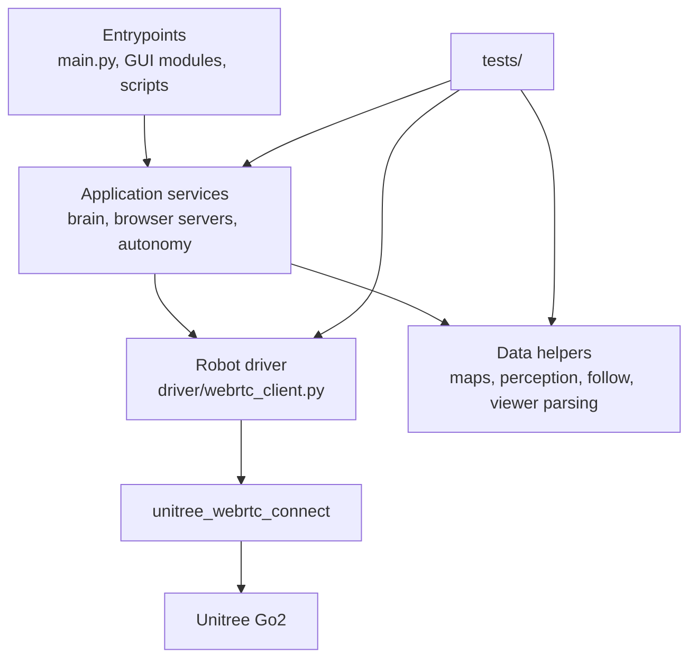
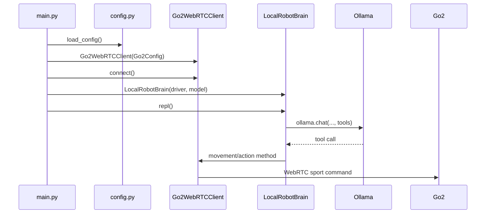
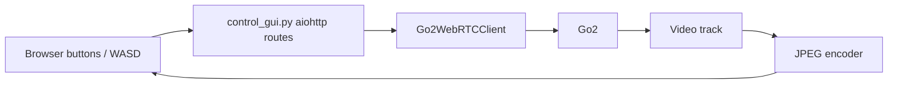
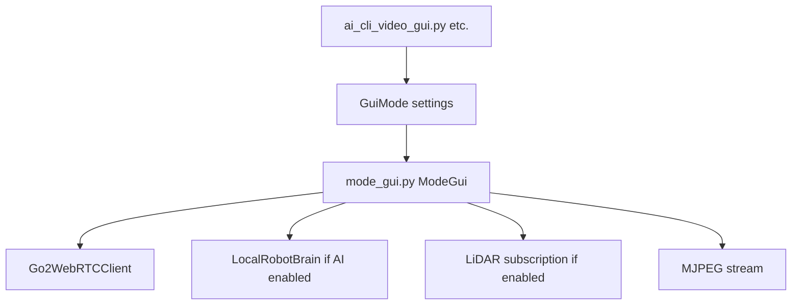
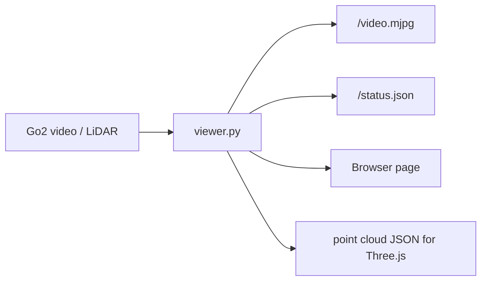
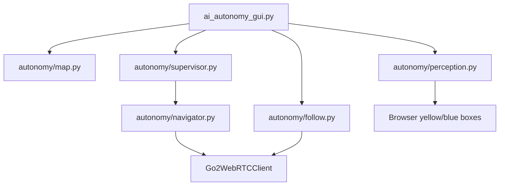

# Code Walkthrough And Upgrade Map

This document is the deep code companion to the big README. The README explains the project as an operator and maintainer manual. This file explains how the scripts and functions work together, where each behavior lives, and exactly where a future human should edit the repo.

The goal is simple: if someone asks, "Where do I change X?", this document should point them to the right file and the right function.

## Mental Model

The repo has four main layers:



Entrypoints start the app. Services decide what should happen. The driver is the only layer that should publish actual robot commands. Data helpers parse, validate, and transform information. Tests pin down the important behavior.

## Which Scripts Work Together For Each Thing

### 1. Terminal AI CLI

Command:

```bash
python -m go2_local_brain.main
```

Flow:



Files involved:

| File | Why it matters |
| --- | --- |
| `src/go2_local_brain/main.py` | Starts the CLI, connects driver, starts the REPL. |
| `src/go2_local_brain/config.py` | Reads `.env` and gives main its settings. |
| `src/go2_local_brain/brain/local_llm.py` | Talks to Ollama and dispatches tool calls. |
| `src/go2_local_brain/driver/webrtc_client.py` | Sends movement and sport commands to the dog. |
| `src/go2_local_brain/safety/limits.py` | Caps move speed and duration. |

Where to edit:

| Desired change | Edit here |
| --- | --- |
| Change model name default | `config.py`, `load_config()` |
| Change AI instructions | `brain/local_llm.py`, `_SYSTEM_PROMPT` |
| Add an AI tool | `brain/local_llm.py`, `_TOOL_SCHEMAS`, `LocalRobotBrain._tools`, a `_tool_*` method |
| Change movement implementation | `driver/webrtc_client.py`, `Go2WebRTCClient.move()` |
| Change speed caps | `safety/limits.py` |

### 2. Manual Video Cockpit

Command:

```bash
python -m go2_local_brain.control_gui --host 0.0.0.0 --port 8770
```

Flow:



Files involved:

| File | Why it matters |
| --- | --- |
| `control_gui.py` | Owns the manual cockpit HTML, WASD route, mode/action buttons, video stream. |
| `driver/webrtc_client.py` | Does actual robot movement and sport commands. |
| `viewer.py` | Provides `_jpeg_from_frame()` helper used by GUI video paths. |

Where to edit:

| Desired change | Edit here |
| --- | --- |
| Add a manual button | `control_gui.py`, HTML string and route/action handler |
| Change keyboard speed | `control_gui.py` if UI-specific, or `safety/limits.py` globally |
| Add an exact sport command button | `control_gui.py`, call `client.sport_command(...)` |
| Fix video encoding | `viewer.py`, `_jpeg_from_frame()` |

### 3. Feature-Specific Browser Modes

Commands:

```bash
python -m go2_local_brain.ai_cli_video_gui --host 0.0.0.0 --port 8771
python -m go2_local_brain.ai_lidar_gui --host 0.0.0.0 --port 8772
python -m go2_local_brain.wasd_video_gui --host 0.0.0.0 --port 8773
python -m go2_local_brain.ai_wasd_lidar_gui --host 0.0.0.0 --port 8774
```

Flow:



Files involved:

| File | Why it matters |
| --- | --- |
| `mode_gui.py` | Shared implementation for the mode GUIs. |
| `ai_cli_video_gui.py` | Wrapper enabling AI + video + hidden keyboard. |
| `ai_lidar_gui.py` | Wrapper enabling AI + video + LiDAR. |
| `wasd_video_gui.py` | Wrapper enabling WASD + video. |
| `ai_wasd_lidar_gui.py` | Wrapper enabling AI + WASD + video + LiDAR. |

Where to edit:

| Desired change | Edit here |
| --- | --- |
| Change shared layout | `mode_gui.py`, `_html_for_mode()` |
| Change which features a wrapper enables | wrapper module's `GuiMode(...)` |
| Add a new mode | create a new wrapper using `make_main(GuiMode(...))` |
| Change AI route behavior | `mode_gui.py` AI route plus `brain/local_llm.py` |
| Change LiDAR parsing/status | `mode_gui.py`, `_summarize_lidar_message()` or `viewer.py` helpers |

### 4. Unified GUI

Command:

```bash
python -m go2_local_brain.gui --host 0.0.0.0 --port 8765
```

Files involved:

| File | Why it matters |
| --- | --- |
| `gui.py` | Older all-in-one GUI with AI commands, manual movement, video, and LiDAR. |
| `brain/local_llm.py` | AI route uses this. |
| `driver/webrtc_client.py` | Manual and AI movement both call this. |

This GUI is useful when everything is working. For debugging, prefer the smaller feature-specific GUIs.

### 5. Standalone Video/LiDAR Viewer

Command:

```bash
python -m go2_local_brain.viewer --host 0.0.0.0 --port 8765
```

Flow:



Files involved:

| File | Why it matters |
| --- | --- |
| `viewer.py` | Owns video stream, LiDAR subscription, LiDAR payload parsing, and viewer HTML. |
| `tests/test_viewer.py` | Tests LiDAR payload parsing helpers. |

Where to edit:

| Desired change | Edit here |
| --- | --- |
| Fix JPEG conversion | `viewer.py`, `_jpeg_from_frame()` |
| Fix LiDAR parsing | `viewer.py`, `_lidar_payload_from_message()` and helpers |
| Change point orientation for Three.js | `viewer.py`, `_orient_points_for_three()` |
| Change max rendered points | `viewer.py`, `_MAX_LIDAR_POINTS` |

### 6. AI-Only Autonomy, Map Builder, Detection, Follow

Command:

```bash
python -m go2_local_brain.ai_autonomy_gui --host 0.0.0.0 --port 8775 --maps-dir maps
```

With vision:

```bash
pip install -e ".[vision]"
python -m go2_local_brain.ai_autonomy_gui --host 0.0.0.0 --port 8775 --maps-dir maps --detector yolo --face-detection
```

Flow:



Files involved:

| File | Why it matters |
| --- | --- |
| `ai_autonomy_gui.py` | Browser UI, routes, video stream, perception loop, follow routes, map save/load. |
| `autonomy/map.py` | Map JSON data, drafts, validation, save/load/list. |
| `autonomy/supervisor.py` | Patrol state machine. |
| `autonomy/navigator.py` | Converts a waypoint into a short movement. |
| `autonomy/perception.py` | Camera-only provider, YOLO provider, face detection, detection serialization. |
| `autonomy/follow.py` | Person-follow controller and local sound cue provider. |
| `tests/test_autonomy.py` | Tests maps, supervisor, perception, and follow math. |

Where to edit:

| Desired change | Edit here |
| --- | --- |
| Change map JSON format | `autonomy/map.py`, then update browser in `ai_autonomy_gui.py` |
| Change patrol decisions | `autonomy/supervisor.py`, `step_once()` |
| Change waypoint movement | `autonomy/navigator.py`, `move_toward()` |
| Change detector backend | `autonomy/perception.py` |
| Change yellow/blue overlay display | `ai_autonomy_gui.py`, `_INDEX_HTML` JavaScript/CSS |
| Change follow steering | `autonomy/follow.py`, `HumanFollowController.plan()` |
| Add stereo sound direction | add provider near `LocalSoundLevelProvider`, return `SoundCue(direction=...)` |

## Function And Class Reference

This section lists the important functions/classes by file.

## `config.py`

### `AppConfig`

Dataclass holding startup settings:

- robot IP,
- AES key,
- Ollama model,
- forced motion mode,
- exploration settings.

Edit this if a new environment setting needs to become a first-class config value.

### `_env_bool(name, default)`

Reads an environment variable and converts common truthy strings:

```text
1, true, yes, on
```

Used by `ENABLE_EXPLORATION`.

### `_env_float(name, default)`

Reads an environment variable and converts it to a float. If the value is missing or invalid, it returns the default.

Used by exploration distance/duration settings.

### `_env_choice(name, default, choices)`

Reads a string environment variable and only accepts it if it is in a known set.

Used by `EXPLORATION_MODE`.

### `load_config()`

Loads `.env`, reads environment variables, normalizes blanks, and returns `AppConfig`.

Where to edit:

- default robot IP,
- default model,
- new env vars,
- validation rules for config.

## `main.py`

### `_configure_logging()`

Turns logging on. Uses `VERBOSE_WEBRTC_LOGS=1` to decide whether third-party logs should be noisy.

### `_amain()`

Async main function:

1. load config,
2. create driver,
3. connect to Go2,
4. create brain,
5. run REPL,
6. close driver.

### `main()`

Normal synchronous Python entry point. Calls `asyncio.run(_amain())`.

## `brain/local_llm.py`

### `_SYSTEM_PROMPT`

The behavior contract for Ollama. It tells the model how to map words to tools.

Edit this when the AI misunderstands prompts.

### `_empty_tool(name, description)`

Helper for tool definitions that need no arguments.

### `_TOOL_SCHEMAS`

The complete list of tools that Ollama can call. Each tool describes:

- name,
- description,
- JSON parameters.

Edit this when adding/removing/changing AI-callable tools.

### `LocalRobotBrain`

Main AI brain class.

Constructor inputs:

- `client`: a `Go2WebRTCClient`,
- `model`: Ollama model name.

Important internal table:

```python
self._tools = {
    "robot_stop": self._tool_stop,
    ...
}
```

This maps an Ollama tool name to a Python method.

### `_tool_*` methods

Each `_tool_*` method wraps one robot behavior. Examples:

| Method | Calls |
| --- | --- |
| `_tool_stand_up` | `client.stand_up()` |
| `_tool_step_forward` | `client.move(0.45, 0.0, 0.0, 0.65)` |
| `_tool_turn_180` | `client.turn_180(direction)` |
| `_tool_sequence` | `client.sequence(steps)` |
| `_tool_explore_room` | `client.explore_room(...)` |
| `_tool_telemetry_report` | `client.telemetry_report()` |

Where to edit:

- Change an AI tool's movement values here if it is tool-specific.
- Add a new `_tool_*` method for a new AI action.

### `handle(user_text)`

One user prompt goes in. One result string comes out.

Steps:

1. build messages,
2. call Ollama in a worker thread,
3. extract tool calls,
4. stop if no tool is returned,
5. stop if unknown tool,
6. run the matching `_tool_*` method,
7. stop if bad args or runtime failure,
8. return a human-readable result string.

This is the safest place to enforce "AI must use tools."

### `repl()`

Terminal loop:

- prints prompt,
- reads user input,
- exits on `quit` or `exit`,
- calls `handle()`.

### `_extract_tool_calls(response)`

Normalizes the shape returned by the Ollama Python client into:

```python
{"name": "...", "arguments": {...}}
```

Edit this only if Ollama response shape changes.

### `_get(obj, key)`

Small compatibility helper for reading either dicts or objects.

### `_format_args(args)`

Formats tool arguments for terminal output.

## `driver/webrtc_client.py`

This is the most important file for robot behavior.

### Constants

Important constants:

| Constant | Purpose |
| --- | --- |
| `_MOVE_REFRESH_HZ` | How often move commands are republished. |
| `_DEADMAN_TICK_S` | How often the deadman checks stale commands. |
| `_DC_OPEN_TIMEOUT_S` | Data channel open timeout. |
| `_STAND_TO_BALANCE_PAUSE_S` | Pause after stand-up before balance. |
| `_EXPLORE_*` | Exploration movement tuning. |
| `_TURN_180_*` | Approximate 180-degree turn tuning. |
| `_MAX_SEQUENCE_STEPS` | Max linked steps from `robot_sequence`. |

### `_ADVANCED_ACTIONS`

Friendly action aliases to exact firmware command candidates.

Example:

```python
"handstand": [("HandStand", {"data": True}), ("Handstand", None)]
```

Edit this when firmware exposes a new stunt/action command.

### `_SEQUENCE_ALIASES`

Maps messy model-generated command strings to known sequence commands.

Example:

```text
robotstepforward -> forward
turnaroundright -> turn_180_right
```

Edit this when the model invents a new spelling that should still be accepted.

### `Go2Config`

Dataclass for driver settings:

- robot IP,
- AES key,
- forced motion mode,
- exploration options.

### `Go2WebRTCClient`

Robot driver class.

#### `connect()`

Creates the `UnitreeWebRTCConnection`, waits for data channel readiness, loads SDK constants, subscribes to sport state, and starts the deadman task.

Edit this to:

- add new telemetry subscriptions,
- add pose-topic subscriptions,
- change connection method,
- change startup behavior.

#### `close()`

Cancels movement/deadman tasks, tries to send stop, disconnects WebRTC.

Edit this if shutdown hangs or needs stronger timeout handling.

#### `stand_up()`, `balance_stand()`, `recovery_stand()`, `sit_down()`

Friendly posture commands.

#### `advanced_action(name)`

Looks up friendly action in `_ADVANCED_ACTIONS` and sends the first command that exists in installed SDK constants.

#### `sport_command(cmd_name, parameter)`

Exact command access. Use this from GUIs when you know the exact Unitree command name.

#### `available_sport_commands()`

Returns all exact sport commands known to the installed SDK.

Useful for diagnostics and future UI lists.

#### `turn_180(direction)`

Approximate 180-degree turn using tested yaw/duration constants.

#### `turn_degrees(direction, degrees)`

Scales the 180-degree turn duration for smaller/larger turns.

#### `dance_move(style)`

Movement macros for `spin`, `sway`, and default hype dance.

#### `sequence(steps)`

Runs up to eight linked commands. Normalizes aliases first. Always stops at the end.

#### `_run_sequence_step(cmd, duration_s)`

Actual command table for sequence steps.

Edit this when adding a new `robot_sequence` command such as `crawl`, `bow`, or `orbit`.

#### `_try_advanced_action(name)`

Attempts an advanced action but logs and continues if unavailable.

Used by dance macros.

#### `stop()`

Cancels movement and sends stop.

This is safety-critical.

#### `move(vx, vy, vyaw, duration_s)`

Clamps velocities, cancels any previous move, starts a move loop, and waits for it.

Edit carefully. This is the central movement path.

#### `explore_room(duration_s, mode)`

Short-step exploration loop.

Modes:

- `telemetry`: require usable obstacle ranges,
- `relaxed`: use ranges if present,
- `blind`: ignore ranges.

#### `telemetry_report()`

Returns a compact sport-state summary for the AI/user.

#### `_move_loop(vx, vy, vyaw, duration_s)`

Publishes repeated move commands until duration expires, then sends stop.

#### `_cancel_move_task()`

Cancels the currently active movement task.

#### `_deadman_loop()`

Background zero-velocity safety loop.

#### `_publish_move(vx, vy, vyaw)`

Builds and publishes the Unitree `Move` payload.

If robot movement stops working, this is one of the first functions to inspect.

#### `_send_stop_move()`

Sends `StopMove` if available, otherwise zero velocity.

#### `_sport_request(cmd_name, parameter, mcf=False)`

Sends one exact sport command by name.

#### `_sport_request_first(candidates)`

Tries candidates until one exists in `SPORT_CMD_MCF` or `SPORT_CMD`.

#### `_valid_range_obstacles()`

Returns usable `range_obstacle` values or `None`.

#### `_pick_explore_turn(ranges, previous)`

Chooses left/right during obstacle-aware exploration.

#### `_find_pubsub(conn)`

Finds the SDK pub/sub object despite upstream naming differences.

#### `_await_datachannel_ready()`

Waits until data channel is open.

#### Helper functions

| Function | Purpose |
| --- | --- |
| `_merge_sport_cmds` | Merge command dictionaries. |
| `_action_candidates` | Build advanced-action candidate list. |
| `_normalize_action_name` | Lowercase/compact friendly action names. |
| `_compact_name` | Remove non-alphanumeric chars. |
| `_canonical_sequence_cmd` | Alias sequence command names. |
| `_request_msg_type` | Compatibility for SDK request message type. |
| `_extract_motion_mode_name` | Parse motion mode response. |
| `_build_sport_request` | Build Unitree sport request payload. |

## `safety/limits.py`

### Constants

| Name | Purpose |
| --- | --- |
| `MAX_VX` | Max forward/back speed. |
| `MAX_VY` | Max strafe speed. |
| `MAX_VYAW` | Max turn speed. |
| `DEFAULT_MOVE_DURATION_S` | Default short move duration. |
| `MAX_MOVE_DURATION_S` | Longest accepted move duration from AI. |
| `DEADMAN_TIMEOUT_S` | Max age before deadman sends zero velocity. |

### `clamp(value, lo, hi)`

Generic helper that keeps a number within bounds.

## `viewer.py`

### `ViewerState`

Dataclass storing latest video, LiDAR, and status counters.

### `Go2BrowserViewer`

Standalone browser viewer class.

Important methods:

| Method | Purpose |
| --- | --- |
| `run()` | Starts aiohttp server and robot connection. |
| `_connect()` | Opens Unitree WebRTC connection. |
| `_start_video()` | Enables video and registers callback. |
| `_start_lidar()` | Subscribes to LiDAR topics. |
| `_recv_video_track()` | Receives frames and stores JPEGs. |
| `_on_lidar_message()` | Parses LiDAR messages and updates state. |
| `_status_json()` | Browser status endpoint. |
| `_video_stream()` | MJPEG endpoint. |
| `_index()` | Browser HTML page. |

### LiDAR Helpers

| Function | Purpose |
| --- | --- |
| `_jpeg_from_frame` | Convert aiortc frame to JPEG bytes. |
| `_lidar_payload_from_message` | Convert raw message to browser payload. |
| `_extract_lidar_positions` | Find positions in known message shapes. |
| `_coerce_position_values` | Normalize position containers. |
| `_points_from_positions` | Build XYZ triples. |
| `_orient_points_for_three` | Rotate/flip points for browser 3D view. |
| `_point_bounds` | Compute min/max bounds. |
| `_xyz_triplets` | Convert flat list to triplets. |
| `_decimate` | Downsample point count. |

## `mode_gui.py`

### `GuiMode`

Dataclass describing which features a mode enables:

- AI,
- keyboard driving,
- LiDAR,
- visible drive panel,
- title.

### `ModeGui`

Shared browser GUI engine.

Important methods:

| Method | Purpose |
| --- | --- |
| `run()` | Start server and connect robot. |
| `_connect()` | Create driver/brain and attach video/LiDAR if needed. |
| `_attach_video()` | Enable video callback. |
| `_attach_lidar()` | Subscribe to LiDAR. |
| `_recv_video_track()` | Store latest JPEG frame. |
| `_api_ai()` | Handle AI prompt requests. |
| `_api_move()` | Handle keyboard movement requests. |
| `_api_mode()` | Handle locomotion mode buttons. |
| `_video_stream()` | Serve MJPEG. |
| `_status_json()` | Return GUI status. |

### Helpers

| Function | Purpose |
| --- | --- |
| `_json_or_empty` | Parse JSON body safely. |
| `_summarize_lidar_message` | Compact LiDAR debug text. |
| `_html_for_mode` | Build browser page for a mode. |
| `make_main` | Create a wrapper module entry point. |

## GUI Wrapper Modules

These are intentionally tiny.

| File | What it does |
| --- | --- |
| `ai_cli_video_gui.py` | Calls `make_main()` with AI/video settings. |
| `ai_lidar_gui.py` | Calls `make_main()` with AI/video/LiDAR settings. |
| `wasd_video_gui.py` | Calls `make_main()` with keyboard/video settings. |
| `ai_wasd_lidar_gui.py` | Calls `make_main()` with AI/keyboard/video/LiDAR settings. |

To add a new mode, copy one of these wrappers and change `GuiMode`.

## `control_gui.py`

### `ControlGui`

Manual-only cockpit.

Important methods:

| Method | Purpose |
| --- | --- |
| `run()` | Start web server and robot connection. |
| `_connect()` | Load config and connect driver. |
| `_attach_video()` | Enable video track. |
| `_recv_video_track()` | Store latest JPEG. |
| `_api_move()` | WASD/QE movement. |
| `_api_stop()` | Stop button. |
| `_api_action()` | Posture/action buttons. |
| `_api_mode()` | Locomotion mode buttons. |
| `_status_json()` | Browser status. |
| `_video_stream()` | MJPEG endpoint. |

Edit `_INDEX_HTML` for visual layout and browser button changes.

## `gui.py`

### `UnifiedGui`

Older combined GUI.

Important methods mirror `ModeGui`, but this class owns everything directly:

- AI prompt,
- manual move,
- locomotion mode,
- video,
- LiDAR,
- status.

Use this as a working all-in-one cockpit, but prefer `mode_gui.py` for new feature-specific modes.

## `ai_autonomy_gui.py`

### `AiAutonomyGui`

AI-only autonomy browser app.

Constructor settings:

- host/port,
- maps directory,
- optional startup map,
- detector type,
- YOLO model/threshold/device,
- face detection flag,
- follow source.

Important methods:

| Method | Purpose |
| --- | --- |
| `run()` | Starts aiohttp server and robot connection. |
| `_connect()` | Connects driver, creates perception/follow, starts perception loop. |
| `_shutdown()` | Stops follow, perception, supervisor, driver. |
| `_attach_video()` | Enables video callback. |
| `_recv_video_track()` | Stores latest JPEG. |
| `_status_json()` | Full GUI state JSON. |
| `_detections_json()` | Latest observation JSON. |
| `_maps_list()` | List maps. |
| `_map_save()` | Save draft or patrol-ready map. |
| `_map_load()` | Load patrol-ready map. |
| `_perception_check()` | Check detector and observe once. |
| `_follow_action()` | Start/stop/step follow mode. |
| `_autonomy_action()` | Activate/pause/resume/stop/step patrol. |
| `_video_stream()` | MJPEG video endpoint. |
| `_status_payload()` | Combines all status into one JSON object. |
| `_load_map()` | Create supervisor from loaded map. |
| `_unload_map()` | Stop and clear supervisor/map. |
| `_make_perception_provider()` | Camera-only or YOLO provider. |
| `_refresh_perception_health()` | Update detector health. |
| `_observe_once()` | Get one observation. |
| `_perception_loop()` | Continuous observation cache. |
| `_follow_loop()` | Continuous follow steps. |
| `_follow_step()` | One follow control decision. |
| `_sound_cue()` | Read optional local sound cue. |
| `_stop_follow()` | Cancel follow and stop robot. |
| `_activation_error()` | Explain why autonomy cannot activate. |

Helper functions:

| Function | Purpose |
| --- | --- |
| `_json_or_empty` | Safely parse JSON request body. |
| `_patrol_map_from_payload` | Convert browser map form into `PatrolMap`. |
| `_string_list` | Convert comma string/list to list of strings. |
| `_parse_args` | CLI args. |
| `_amain` | Async entry. |
| `main` | Sync entry. |

Where to edit:

| Desired change | Edit here |
| --- | --- |
| Add a browser control | `_INDEX_HTML`, matching route method |
| Change detection overlay | `_INDEX_HTML` CSS/JS `drawDetections()` |
| Change activation requirements | `_activation_error()` |
| Change follow source choices | `_parse_args()` and `_sound_cue()` |
| Change perception polling rate | `_perception_loop()` |

## `autonomy/map.py`

### `Waypoint`

One named coordinate with optional yaw/note.

### `PatrolMap`

Map object:

- name,
- waypoint dictionary,
- route list,
- no-go zone list.

Methods:

| Method | Purpose |
| --- | --- |
| `next_waypoint(index)` | Return route waypoint by index, wrapping around. |
| `validate_for_patrol()` | Require waypoints and valid route. |
| `to_dict()` | Serialize to JSON-compatible dict. |

Functions:

| Function | Purpose |
| --- | --- |
| `load_patrol_map` | Load JSON file. |
| `patrol_map_from_dict` | Parse already-loaded JSON dict. |
| `empty_patrol_map` | Blank editor map. |
| `save_patrol_map` | Save JSON under safe filename. |
| `list_patrol_maps` | Return map metadata and ready/draft state. |
| `safe_map_filename` | Convert map name into safe slug. |
| `_waypoint_from_dict` | Parse one waypoint. |
| `_map_ready` | Boolean wrapper around validation. |

## `autonomy/navigator.py`

### `RobotMover`

Protocol saying a robot-like object must have:

```python
move(...)
stop()
```

This lets tests use fake clients.

### `AutonomyNavigator`

Converts a waypoint into short movement.

Methods:

| Method | Purpose |
| --- | --- |
| `move_toward(waypoint)` | Turn, step, or scan based on waypoint vector. |
| `scan()` | Small left/right scan. |
| `stop()` | Stop robot. |

Edit here for better patrol movement.

## `autonomy/supervisor.py`

### `AutonomyStatus`

Status snapshot for browser/tests.

### `AutonomySupervisor`

Patrol state machine.

Methods:

| Method | Purpose |
| --- | --- |
| `activate()` | Start background patrol task. |
| `pause()` | Pause and stop movement. |
| `resume()` | Resume patrolling. |
| `stop()` | Cancel task and stop robot. |
| `status()` | Return `AutonomyStatus`. |
| `step_once()` | One perception/patrol decision. |
| `_run()` | Background loop. |
| `_investigate()` | Scan when detection appears. |
| `_event()` | Append event log entry. |

Helper:

| Function | Purpose |
| --- | --- |
| `_has_interesting_detection` | True if any detection confidence is high enough. |

Edit `step_once()` for autonomy policy changes.

## `autonomy/perception.py`

### `Detection`

One visual detection:

- label,
- confidence,
- center x/y,
- width/height.

Methods:

| Method | Purpose |
| --- | --- |
| `is_human()` | True for `person`/`human`. |
| `is_face()` | True for face labels. |

### `Observation`

One perception snapshot:

- timestamp,
- whether frame exists,
- detections,
- frame width/height,
- note.

Methods:

| Method | Purpose |
| --- | --- |
| `summary()` | Compact text summary. |
| `to_dict()` | Browser/API JSON. |

### `PerceptionHealth`

Ready/backend/detail tuple for status.

### `PerceptionProvider`

Interface for detectors:

```python
async def observe() -> Observation
async def health() -> PerceptionHealth
```

### `CameraOnlyPerceptionProvider`

Reports frame availability but no detections. Not considered detector-ready.

### `CallbackPerceptionProvider`

Adapter for callback-based future detectors.

### `YoloPerceptionProvider`

YOLO detector over latest JPEG frame.

Important behavior:

- lazy-loads `ultralytics`,
- runs prediction in a worker thread,
- can add optional OpenCV face boxes,
- returns frame dimensions for overlay scaling.

Helper functions:

| Function | Purpose |
| --- | --- |
| `_image_from_jpeg` | Decode JPEG to PIL image. |
| `_detections_from_results` | Convert YOLO result boxes to `Detection`. |
| `_face_detections_from_image` | Optional OpenCV Haar face boxes. |
| `best_human_detection` | Highest-confidence human/person. |
| `detection_to_dict` | JSON-friendly detection. |
| `_normalized_box` | Convert pixels to normalized browser box. |

## `autonomy/follow.py`

### `FollowMover`

Protocol requiring `move(...)`. Lets follow work with real or fake robot clients.

### `SoundCue`

Local sound event:

- timestamp,
- level,
- optional direction.

Direction is intended as signed radians.

### `FollowCommand`

Planned short movement:

- forward speed,
- yaw speed,
- duration,
- reason.

### `FollowStatus`

Status dataclass reserved for follow state reporting.

### `HumanFollowController`

Person-follow brain.

Methods:

| Method | Purpose |
| --- | --- |
| `step(observation, sound_cue)` | Plan and execute one follow move. |
| `plan(observation, sound_cue)` | Pure decision logic without sending movement. |

Decision rules:

- best person box off-center -> turn toward it,
- person far/small -> move forward,
- person too close/large -> back away,
- no person + sound -> scan,
- no person + no sound -> scan for person.

### `LocalSoundLevelProvider`

Optional mono microphone cue provider using `sounddevice`.

It does not provide direction. It only says "sound happened."

Helpers:

| Function | Purpose |
| --- | --- |
| `_relative_center` | Convert pixel center to 0..1. |
| `_relative_size` | Convert pixel size to 0..1. |
| `_clamp` | Bound values. |

## `viz/rerun_logger.py`

### `RerunLogger`

Optional visualization/logging helper for Rerun.

Use this for future visual debugging, not for core robot control.

## Scripts

### `scripts/smoke_test_imports.py`

Function:

| Function | Purpose |
| --- | --- |
| `main()` | Imports important modules and exits nonzero if imports fail. |

Use after install:

```bash
python scripts/smoke_test_imports.py
```

### `scripts/eval_model_tools.py`

Evaluates whether an Ollama model chooses the expected tools for a set of prompts.

Functions/classes:

| Name | Purpose |
| --- | --- |
| `EvalResult` | One prompt/model score result. |
| `_finite_number` | Validate numeric tool args. |
| `_score_tool_calls` | Decide if a tool response is acceptable. |
| `evaluate_prompt` | Ask model one prompt and score it. |
| `main_async` | Run the whole eval set. |
| `main` | CLI entry point. |

Use this when comparing `qwen3:1.7b` to another local model or changing `_SYSTEM_PROMPT`.

## Tests And What They Protect

### `tests/test_brain.py`

Protects:

- Ollama tool extraction,
- movement arg validation,
- unknown tool handling,
- stop-on-error behavior.

Edit/add here when changing `brain/local_llm.py`.

### `tests/test_driver.py`

Protects:

- move payloads,
- speed clamps,
- sport-state parsing,
- sequence aliases,
- advanced actions,
- exploration guards,
- stop resilience,
- motion mode parsing.

Edit/add here when changing `driver/webrtc_client.py`.

### `tests/test_viewer.py`

Protects:

- LiDAR payload parsing,
- point extraction and orientation.

Edit/add here when changing `viewer.py` LiDAR helpers.

### `tests/test_autonomy.py`

Protects:

- map load/save/list behavior,
- draft maps,
- supervisor steps,
- detection-triggered investigate behavior,
- perception health,
- detection JSON normalization,
- follow controller decisions.

Edit/add here when changing `autonomy/*` or `ai_autonomy_gui.py`.

## Upgrade Recipes

### Change The Dog's Default Forward Speed

Global cap:

```text
src/go2_local_brain/safety/limits.py
```

Specific AI step:

```text
src/go2_local_brain/brain/local_llm.py
_tool_step_forward()
```

Sequence forward step:

```text
src/go2_local_brain/driver/webrtc_client.py
_run_sequence_step()
```

Manual GUI speed:

```text
src/go2_local_brain/control_gui.py
or
src/go2_local_brain/mode_gui.py
```

### Add A New Firmware Action

1. Confirm exact name in installed `unitree_webrtc_connect` constants.
2. Add it to `_ADVANCED_ACTIONS` in `driver/webrtc_client.py`.
3. Add a tool schema to `_TOOL_SCHEMAS` if AI should call it.
4. Add `_tool_new_action()` in `LocalRobotBrain`.
5. Add button in `control_gui.py` or `mode_gui.py` if GUI should call it.
6. Add tests.

### Improve Human Following

Edit:

```text
src/go2_local_brain/autonomy/follow.py
HumanFollowController.plan()
```

Tune:

- `target_height`,
- `deadband`,
- `max_forward`,
- `max_turn`,
- `duration_s`.

Tests:

```bash
PYTHONPATH=src python -m unittest tests.test_autonomy
```

### Improve Detection

Edit:

```text
src/go2_local_brain/autonomy/perception.py
```

Likely changes:

- lower/raise YOLO threshold,
- add another detector provider,
- change face detection,
- add class filters,
- improve box normalization.

Update browser overlay if output shape changes:

```text
src/go2_local_brain/ai_autonomy_gui.py
drawDetections()
```

### Improve Maps

Edit:

```text
src/go2_local_brain/autonomy/map.py
```

If changing JSON shape:

1. bump or handle `schema_version`,
2. update `patrol_map_from_dict`,
3. update `to_dict`,
4. update browser map builder in `ai_autonomy_gui.py`,
5. update tests in `tests/test_autonomy.py`.

### Improve Patrol

Policy:

```text
src/go2_local_brain/autonomy/supervisor.py
step_once()
```

Movement:

```text
src/go2_local_brain/autonomy/navigator.py
move_toward()
```

Pose/localization future work likely needs driver telemetry subscriptions:

```text
src/go2_local_brain/driver/webrtc_client.py
connect()
```

### Fix LiDAR Rendering

Start here:

```text
src/go2_local_brain/viewer.py
_lidar_payload_from_message()
_orient_points_for_three()
```

Then check GUI-specific LiDAR in:

```text
src/go2_local_brain/mode_gui.py
src/go2_local_brain/gui.py
```

Use tests:

```bash
PYTHONPATH=src python -m unittest tests.test_viewer
```

### Change Ollama Model Behavior

Edit prompt/tools:

```text
src/go2_local_brain/brain/local_llm.py
```

Evaluate:

```bash
python scripts/eval_model_tools.py qwen3:1.7b
```

Run tests:

```bash
PYTHONPATH=src python -m unittest tests.test_brain
```

## Dependency Map

Required dependencies from `pyproject.toml`:

| Dependency | Used for |
| --- | --- |
| `unitree_webrtc_connect` | Robot WebRTC connection and SDK constants. |
| `ollama` | Local LLM tool calling. |
| `rerun-sdk` | Optional visualization logging. |
| `python-dotenv` | `.env` loading. |
| `aiohttp` | Browser GUI web servers. |
| `pillow` | JPEG encoding/decoding. |

Optional extras:

| Extra | Installs | Used for |
| --- | --- | --- |
| `[vision]` | `ultralytics`, `opencv-python-headless` | YOLO person detection and optional face boxes. |
| `[audio]` | `sounddevice`, `numpy` | Local microphone sound cue. |

## What Not To Do

- Do not put raw robot protocol publishing in random GUI files. Add a driver method instead.
- Do not let the LLM run an infinite velocity loop.
- Do not make YOLO/audio mandatory for normal control.
- Do not assume LiDAR obstacle values are valid when they are all zeros.
- Do not commit personal/home maps unless intentionally sharing them.
- Do not test jump/backstand/handstand near people, stairs, cables, or fragile objects.

## Best Next Human Upgrades

Recommended order:

1. Land stop/shutdown timeout hardening in `driver/webrtc_client.py`.
2. Add pose-topic probe and cache for real patrol localization.
3. Improve LiDAR parsing/rendering with captured payload samples.
4. Add stereo sound direction provider returning `SoundCue(direction=...)`.
5. Add no-go zone enforcement in maps/navigator.
6. Add patrol/follow run logs.
7. Add a browser page for exact installed `SPORT_CMD` discovery.

The architecture is ready for all of these, but each should be done in a small branch with tests.
