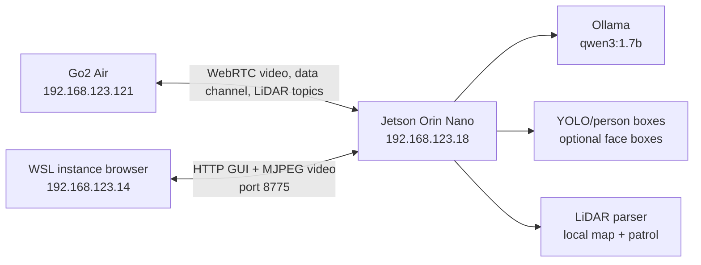

# Jetson Orin Deployment

This is the recommended layout when the Jetson is mounted near the robot and the WSL instance is only used as a browser/control station.

## Target Architecture



The Jetson does not need to push video with a separate upload process. It receives the robot WebRTC video, encodes frames as JPEG, and serves them at `/video.mjpg`. The WSL instance opens `http://192.168.123.18:8775` and pulls the stream from the Jetson.

## Why This Layout Is Best

- WebRTC stays close to the robot on the same private robot network.
- LiDAR parsing and occupancy mapping run on the machine that is also driving.
- Ollama reasoning stays local to the Jetson, so the robot does not depend on the WSL instance for decisions.
- The WSL instance can disconnect without killing the robot process, as long as the Jetson service stays up.
- The browser gets video, status, map controls, manual override, AI commands, patrol, and follow controls from one address.

## One-Time Jetson Install

Run these on the Jetson:

```bash
sudo apt update
sudo apt install -y git curl python3 python3-venv python3-pip portaudio19-dev
mkdir -p ~/robotics
cd ~/robotics
git clone https://github.com/creeskis/go2_local_brain.git
cd go2_local_brain
python3 -m venv .venv
source .venv/bin/activate
python -m pip install --upgrade pip wheel setuptools
pip install -e ".[vision,audio]"
```

Install Ollama and pull the small default model:

```bash
curl -fsSL https://ollama.com/install.sh | sh
ollama pull qwen3:1.7b
ollama list
```

Create the Jetson environment file:

```bash
cp .env.jetson.example .env
nano .env
```

Minimum values:

```env
GO2_IP=192.168.123.121
OLLAMA_MODEL=qwen3:1.7b
GO2_GUI_HOST=0.0.0.0
GO2_GUI_PORT=8775
GO2_DETECTOR=yolo
GO2_YOLO_DEVICE=0
```

Leave `OLLAMA_HOST` unset when Ollama and Python both run on the Jetson. Set `OLLAMA_HOST=http://192.168.123.18:11434` only when Python runs somewhere else and calls the Jetson's Ollama server over the LAN.

## First Manual Run

Run this before enabling systemd:

```bash
cd ~/robotics/go2_local_brain
source .venv/bin/activate
python scripts/smoke_test_imports.py
./scripts/run_jetson_cockpit.sh
```

From the WSL instance or laptop browser, open:

```text
http://192.168.123.18:8775
```

Expected result:

- live video appears,
- WASD/manual buttons move the robot,
- status shows a connected WebRTC session,
- YOLO status becomes ready after the first frames,
- LiDAR status increments if the robot publishes LiDAR topics,
- saved maps appear under `maps/`.

If the script is not executable after cloning:

```bash
chmod +x scripts/run_jetson_cockpit.sh
```

The run script reads `.env` before starting Python, so the same file controls manual runs and systemd runs.

## Systemd Service

The service template assumes this path:

```text
/home/jetson/robotics/go2_local_brain
```

If your user or path differs, use the installer script. It renders the service with the current username, group, and repo path:

```bash
cd ~/robotics/go2_local_brain
chmod +x scripts/install_jetson_service.sh
./scripts/install_jetson_service.sh
sudo systemctl start go2-local-brain
sudo systemctl status go2-local-brain --no-pager
```

Manual install is also possible if you want to edit the service yourself:

```bash
cd ~/robotics/go2_local_brain
sudo cp deploy/systemd/go2-local-brain.service /etc/systemd/system/go2-local-brain.service
sudo systemctl daemon-reload
sudo systemctl enable go2-local-brain
sudo systemctl start go2-local-brain
sudo systemctl status go2-local-brain --no-pager
```

Watch logs:

```bash
journalctl -u go2-local-brain -f
```

Restart after pulling updates:

```bash
cd ~/robotics/go2_local_brain
git pull
source .venv/bin/activate
pip install -e ".[vision,audio]"
sudo systemctl restart go2-local-brain
```

## Video Path

The video path is:

```text
Go2 camera -> WebRTC -> Jetson Python process -> JPEG frames -> /video.mjpg -> browser
```

The browser does not talk directly to the robot. It talks to the Jetson. This means firewall and routing only need to allow:

- Jetson to robot: WebRTC/signaling on the private robot network.
- WSL instance to Jetson: TCP `8775`.

## LiDAR Path

The LiDAR path is:

```text
Go2 LiDAR topics -> WebRTC data channel -> viewer decoder -> robot-space points -> local map -> browser map
```

The map should be created and saved from the browser after the robot has seen the room. On restart, load the saved map and use the localization lock to tell the UI where the robot started inside that saved map.

## AI Path

The AI command path is:

```text
Browser prompt -> Jetson GUI route -> LocalRobotBrain -> Ollama -> tool call -> WebRTC sport command
```

Keep the default model at `qwen3:1.7b` on the Orin Nano until larger models are proven stable. It is small enough for responsive tool calls and still handles structured robot commands.

## YOLO On Jetson

Start with:

```bash
GO2_YOLO_DEVICE=0 ./scripts/run_jetson_cockpit.sh
```

If YOLO fails to use CUDA, test CPU mode:

```bash
GO2_YOLO_DEVICE=cpu ./scripts/run_jetson_cockpit.sh
```

CPU mode is slower, but it confirms that the camera and detector pipeline are wired correctly before tuning Jetson PyTorch/CUDA packages.

## Network Checks

Run these on the Jetson:

```bash
ping -c 3 192.168.123.121
curl http://127.0.0.1:11434/api/tags
ss -ltnp | grep 8775
```

Run this from the WSL instance:

```bash
curl http://192.168.123.18:8775/api/status
```

## Practical Operating Flow

1. Power the robot and confirm it is on the private network.
2. Power the Jetson and wait for `go2-local-brain` to start.
3. Open `http://192.168.123.18:8775` from the WSL instance.
4. Use manual controls to verify motion.
5. Verify live video.
6. Verify YOLO person boxes if a person is visible.
7. Drive or slow-patrol the room to collect LiDAR.
8. Save the map.
9. On future starts, load that map and set the localization lock before patrol.

## When To Expose Ollama On The LAN

Do not expose Ollama just for the recommended Jetson mode. The Python process and Ollama are both on the Jetson, so local access is enough.

Expose Ollama only for this alternate layout:

```text
Python runs in WSL instance -> Ollama runs on Jetson
```

In that case, configure the Ollama service to listen on `0.0.0.0:11434`, then set this in the WSL instance:

```bash
export OLLAMA_HOST=http://192.168.123.18:11434
```

Keep that limited to the private robot network.
